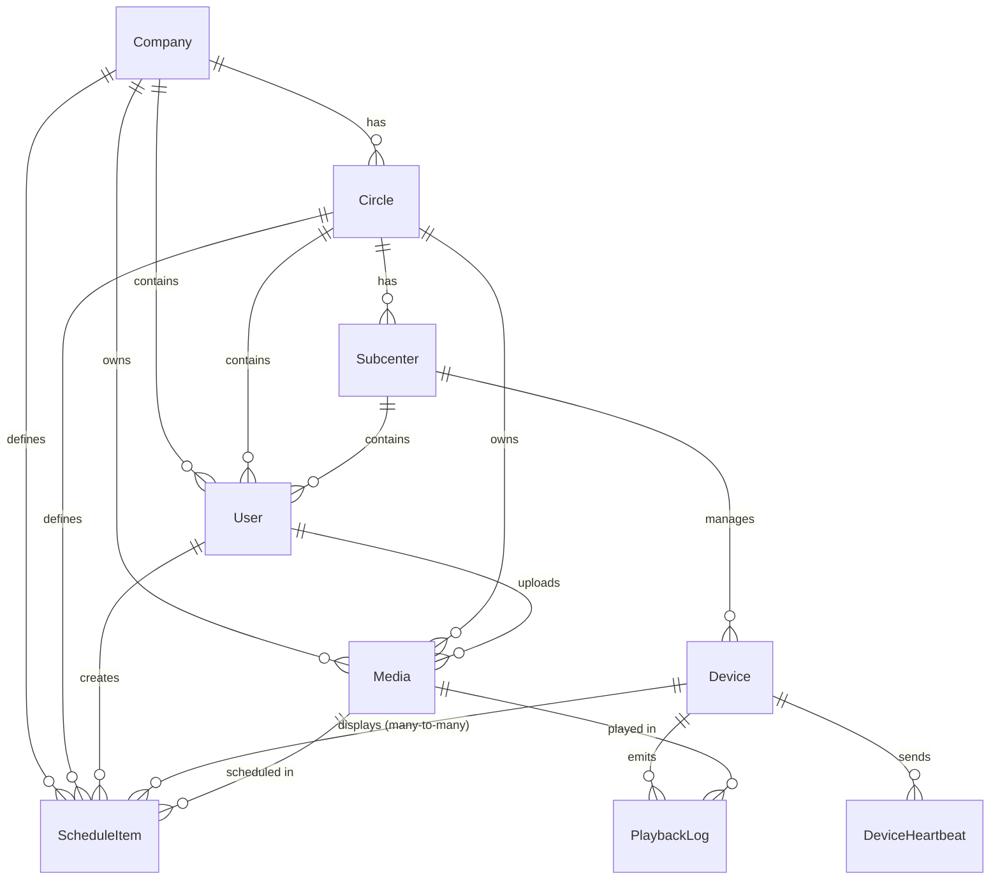
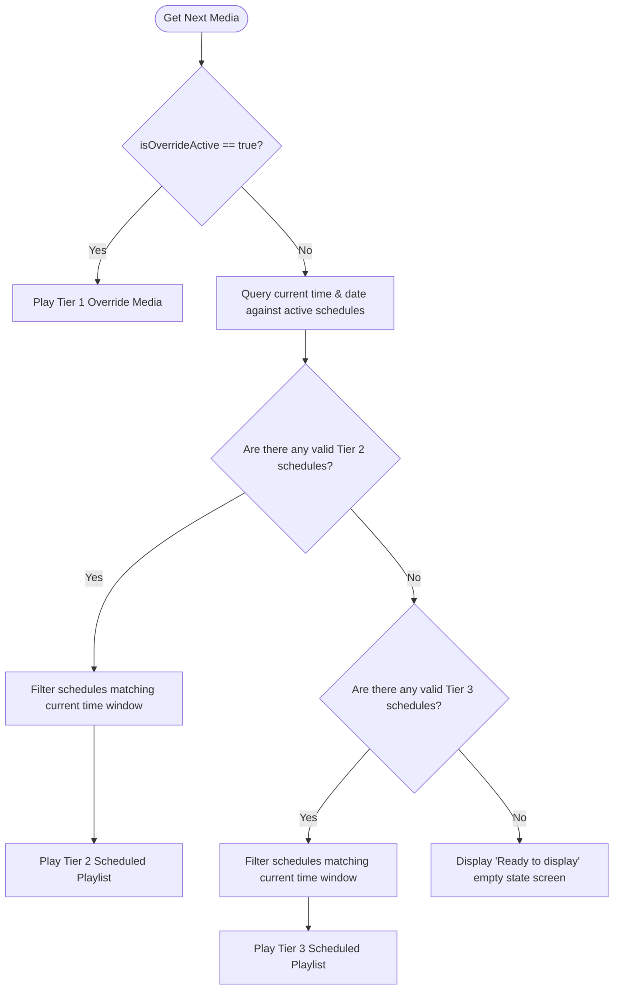

# System Design Documentation: Desh-IT Dash
## Cloud-Hosted Enterprise Digital Signage System

This document provides a comprehensive technical overview of the system architecture, design decisions, database models, protocols, security policies, and deployment/usage workflows for **Desh-IT Dash** (also referred to as the **Digital Signage Dashboard**).

---

## 1. Executive Summary & Design Philosophy

**Desh-IT Dash** is an enterprise-grade digital signage platform designed to manage and distribute content across a distributed hierarchy of displays (such as TV screens, tablets, and kiosks). The system enables real-time push notifications, priority scheduling, audit logging, playback analytics, and robust offline-first caching for display endpoints.

### Creative North Star: "The Luminous Curator"
As outlined in the design system guidelines ([DESIGN.md](file:///d:/AI%20Project/Digital%20Dashboard/DESIGN.md)), the user interface rejects dense, cluttered grids typical of enterprise software. It treats the administrative dashboard as a clean, editorial gallery space using:
*   **The "No-Line" Rule**: Structural segregation is achieved via background tone shifts (`surface` vs `surface_container_low`) and generous negative padding, completely avoiding harsh 1px solid borders.
*   **Translucent Layering**: Floating modals, settings menus, and dropdowns utilize glassmorphism (frosted glass background with Backdrop Blur and Indigo-tinted ambient shadows).
*   **High Typographic Contrast**: A dual font family schema is enforced—**Manrope** for large display statistics and titles (with negative tracking), and **Inter** for small data points and interface labels.

---

## 2. High-Level System Architecture

The application is built on a decoupled, three-tier architecture that is fully containerized and horizontally scalable.

### Architectural Diagram

```
                       ┌───────────────────────────────┐
                       │           Web CMS             │
                       │     (React / Vite / TS)       │
                       │           Port: 3000          │
                       └───────────────┬───────────────┘
                                       │
                                       │ HTTP REST (Admin & API actions)
                                       ▼
                       ┌───────────────────────────────┐
                       │          Backend API          │
                       │    (Node.js / Express / TS)   │
                       │           Port: 3001          │
                       └──────┬────────┬────────┬──────┘
                              │        │        │
     Prisma ORM Client        │        │        │ Socket.io (Real-time events)
   ┌──────────────────────────┘        │        └──────────────────────────┐
   │                                   │ Redis Pub/Sub Adapter             │
   ▼                                   ▼                                   ▼
┌──────────────────┐          ┌──────────────────┐                ┌──────────────────┐
│  PostgreSQL DB   │          │  Redis In-Memory │                │  TV / Display    │
│  (Data Store)    │          │  (Cache & Sync)  │                │  (Web / Native)  │
│  Port: 5432      │          │  Port: 6379      │                │  Port: 3002      │
└──────────────────┘          └──────────────────┘                └──────────────────┘
                                       │
                                       │ S3 SDK (Object Storage)
                                       ▼
                              ┌──────────────────┐
                              │    MinIO / S3    │
                              │  (Media Storage) │
                              │  Port: 9000/9001 │
                              └──────────────────┘
```

### Components Summary

1.  **Web CMS (Admin Panel)**: Built on React 19, Vite, and Tailwind CSS. Serves as the central interface for configuring companies, circles, subcenters, registering devices, uploading media, and creating playback schedules.
2.  **Backend REST API**: An Express.js application written in TypeScript. It handles JWT authentication, enforces Role-Based Access Control (RBAC), exposes CRUD routes, writes audit logs, manages file uploads, and acts as the real-time coordinator using Socket.io.
3.  **Database Layer**: Uses Prisma ORM with a PostgreSQL database in production and SQLite during local development fallback.
4.  **Real-Time & Caching Layer**: Redis manages the transient enrollment codes (pairing and repair codes) and distributes WebSocket events across backend nodes using the Socket.io Redis adapter.
5.  **Object Storage (Media Delivery)**: MinIO simulates S3 locally, offering public-read read buckets and pre-signed write URLs. It drops back to local filesystem storage if S3 credentials are not configured.
6.  **Observability & Monitoring**: Prometheus scrapes custom and default HTTP/WS metrics from the backend API `/metrics` endpoint. Grafana visualizes these metrics on pre-configured dashboards.

---

## 3. Organizational Hierarchy & Scoping

The system architecture mirrors a strict, nested corporate hierarchy:

$$\text{Company} \longrightarrow \text{Circle} \longrightarrow \text{Subcenter} \longrightarrow \text{Device}$$

This structure scopes resources, users, and capabilities across the system:

*   **Company**: The tenant root (e.g., an entire corporate franchise).
*   **Circle**: A regional division or business unit within the company.
*   **Subcenter**: A specific local center, branch, or store.
*   **Device**: Individual physical displays assigned to a Subcenter.

### Scoping Rules:
*   **Users** carry a `companyId`, `circleId`, and/or `subcenterId`. A user can only manage resources (media, schedules, devices) at or below their structural assignment.
*   **Media** and **Schedules** have similar scope bindings. A subcenter-level admin cannot view or target devices belonging to a different subcenter or circle.

---

## 4. Database Schema (Prisma Design)

The database schema is defined in [schema.prisma](file:///d:/AI%20Project/Digital%20Dashboard/backend/prisma/schema.prisma). Relationships are structured with cascade deletions on critical hierarchical transitions.



### Table Definitions & Primary Columns

#### Hierarchy Tables
*   `Company`: `id` (UUID), `name` (unique), timestamps.
*   `Circle`: `id` (UUID), `name`, `companyId` (foreign key to `Company`).
*   `Subcenter`: `id` (UUID), `name`, `circleId` (foreign key to `Circle`, nullable).

#### User Accounts
*   `User`: `id` (UUID), `email` (unique), `passwordHash`, `role` (String), `companyId`, `circleId`, `subcenterId` (nullable, scoping), `emailVerified`, `mustChangePassword` (Boolean).

#### Device Registers
*   `Device`: `id` (UUID), `name`, `subcenterId` (foreign key to `Subcenter`), `lastHeartbeat`, `isOnline` (Boolean), `socketId` (nullable mapping to current WS session), `pairedAt` (DateTime, tracks first TV enrollment).

#### Media Resources
*   `Media`: `id` (UUID), `filename`, `url` (original asset URL), `tvFilename`/`tvUrl` (TV-optimized H.264 video variants), `type` (`IMAGE` / `VIDEO` / `TEXT` / `PDF`), `size`, `uploadedBy` (foreign key to `User`), `isPublic` (Boolean), `publishedBy` (scope tier, e.g. `SUBCENTER`), generated fields for AI/narrative tools (`narrative`, `generatedImageUrl`, `generatedImages`, `keyPoints`).

#### Content Classification
*   `MediaCategory`: `id` (UUID), `name`, `companyId` (unique constraint on `[name, companyId]`).
*   `MediaContentType`: `id` (UUID), `name`, `categoryId` (foreign key to `MediaCategory`), `companyId` (unique constraint on `[name, categoryId]`).

#### Scheduling Engine
*   `ScheduleItem`: `id` (UUID), `mediaId` (foreign key to `Media`), `tier` (priority tier string: `TIER_1` / `TIER_2` / `TIER_3`), `startDate`/`endDate` (DateTime range), `startTime`/`endTime` (String "HH:mm" daily constraint), `isRecurring` (Boolean), `isActive` (Boolean), `createdBy` (foreign key to `User`), `companyId`, `circleId`.
*   Note: A many-to-many implicit relationship table `_DeviceSchedules` links `Device` and `ScheduleItem`.

#### Analytics & Logs
*   `PlaybackLog`: `id` (UUID), `deviceId` (foreign key to `Device`), `mediaId` (foreign key to `Media`), `tier`, `startedAt`, `endedAt` (nullable), `completed` (Boolean).
*   `DeviceHeartbeat`: `id` (UUID), `deviceId` (foreign key to `Device`), `timestamp`, `isOnline` (Boolean).
*   `AuditLog`: `id` (UUID), `userId` (foreign key to `User`), `action` (String), `target` (String, e.g. `Device:id`), `changes` (JSON payload of modified attributes), `ipAddress`, `timestamp`.

---

## 5. Security & Access Control Model

### Role Hierarchy & Capabilities
The system enforces Role-Based Access Control (RBAC) via numerical power levels. A user with a higher role power level implicitly possesses all abilities of lower roles.

| Role | Power Level | Scope Control | Main Capabilities |
| :--- | :---: | :--- | :--- |
| **`CENTRAL_ADMIN`** | `4` | Entire System | Manage companies, users, system-wide media, and audits. |
| **`COMPANY_ADMIN`** | `3` | Single Company | Manage company circles, subcenters, local users, and TIER_2 corporate content. |
| **`CIRCLE_ADMIN`** | `2` | Single Circle | Manage circle subcenters, circle-wide media, and TIER_2/TIER_3 schedules. |
| **`SUBCENTER_ADMIN`** | `1` | Single Subcenter | Register local devices, manage playback analytics, and deploy local TIER_3 media. |

Backend auth middleware ([auth.ts](file:///d:/AI%20Project/Digital%20Dashboard/backend/src/middleware/auth.ts)) exposes RBAC route guards (`requireCentralAdmin`, `requireCompanyAdmin`, etc.) that evaluate the user's role power level using a utility function:
```typescript
export function rolePowerLevel(role: string): number {
  switch (role) {
    case 'CENTRAL_ADMIN': return 4
    case 'COMPANY_ADMIN': return 3
    case 'CIRCLE_ADMIN': return 2
    case 'SUBCENTER_ADMIN': return 1
    default: return 0
  }
}
```

### Device Enrollment & Pairing Protocol
Display players are decoupled from direct user credentials. Enrollment is completed via ephemeral pairing/repair codes:

```
[TV Player UI]                               [CMS Admin Panel]                         [Redis In-Memory]
      │                                              │                                         │
      │ (1) Device displays pairing page             │                                         │
      │     and inputs Server URL                    │                                         │
      │─────────────────────────────────────────────>│                                         │
      │                                              │ (2) Admin clicks "Pair" on registered   │
      │                                              │     device; POST /devices/:id/pair-code │
      │                                              │────────────────────────────────────────>│
      │                                              │                                         │ (3) Generates 6-digit code
      │                                              │                                         │     Saves to Redis (TTL = 300s)
      │                                              │<────────────────────────────────────────│
      │                                              │
      │                                              │ (4) Admin views 6-digit code in CMS
      │                                              │     and inputs code on physical display
      │<─────────────────────────────────────────────│
      │
      │ (5) POST /api/devices/pair/confirm { code }
      │───────────────────────────────────────────────────────────────────────────────────────>│
      │                                                                                        │ (6) Reads pairing record
      │                                                                                        │     Verifies validity
      │                                                                                        │     Generates 365-day JWT
      │                                                                                        │     Deletes pairing code
      │<───────────────────────────────────────────────────────────────────────────────────────│
      │
      │ (7) Stores device token in SafeStorage
      │     and initiates Socket.io session
      ▼
```

*   **Repairing**: If a device needs to be re-paired or reassigned, the admin generates a repair code (`POST /devices/:id/repair`), and the TV player confirms it at `/devices/repair/confirm` to generate a fresh long-lived JWT token.

---

## 6. Real-Time Synchronization Protocol

Real-time synchronization between the CMS and the TV players is managed via a dedicated Socket.io channel using a Redis adapter backing store for node-to-node events replication.

```
       TV Display (Client)                                          Backend Server
               │                                                          │
               │────────── register { deviceId, token } ─────────────────>│  (Associates socket session
               │                                                          │   with device database ID)
               │                                                          │
               │────────── heartbeat { deviceId } (every 60s) ───────────>│  (Keeps connection alive,
               │                                                          │   updates lastHeartbeat & DB log)
               │                                                          │
               │<───────── PLAY_OVERRIDE { mediaId, url, tier } ──────────│  (Pushes instant override
               │                                                          │   e.g., Emergency broadcast)
               │                                                          │
               │<───────── RESUME_SCHEDULE ───────────────────────────────│  (Resumes normal scheduling
               │                                                          │   loop after override)
               │                                                          │
               │<───────── SYNC_CONTENT ──────────────────────────────────│  (Forces device to refetch
               │                                                          │   and reload cached schedule)
               │                                                          │
               │────────── playback_started { deviceId, mediaId, tier } ─>│  (Logs media start event)
               │                                                          │
               │────────── playback_ended { deviceId, mediaId, comp } ───>│  (Logs media stop event)
               ▼                                                          ▼
```

---

## 7. Content Priority System (Tier Resolution Engine)

To prevent conflicts when multiple schedules overlap, the player evaluates play tasks according to a strict three-tier precedence engine.

### Priority Tiers

1.  **Tier 1: Emergency / Central Override**: System-wide or circle-wide broadcasts. Instantly triggers full-screen takeover and blocks all other scheduled playlists. Managed through Socket.io messages.
2.  **Tier 2: Circle / Corporate Scheduled**: Medium-priority corporate campaigns scheduled by regional (Circle) or headquarter (Company) administrators.
3.  **Tier 3: Local / Subcenter Content**: Low-priority local content managed by branch or site admins (e.g. local promotions, branch opening hours).

### Precedence Resolution Flow (`getNextMedia()`)



*   **Playlist Looping**: If multiple schedules exist at the active tier, the player groups them and loops through them sequentially as a playlist.
*   **Time Constraints**: Daily constraints (`startTime` & `endTime`) and date ranges (`startDate` & `endDate`) are evaluated by the player using the device's local clock to respect timezone differences.

---

## 8. TV Player Playback & Offline-First Strategy

Display players run in environments where network stability cannot be guaranteed. Therefore, the player relies on aggressive media and schedule caching.

### Web TV Player Core Mechanism
*   **Media Caching**: The TV Player uses the browser's native **Cache API** (opening a cache sandbox named `digital-signage-cache-v1`).
*   **Preloading**: When schedules are synchronized, the player runs a pre-fetching queue, saving image, PDF, and video assets to local browser storage.
*   **Playback Failover**: If the connection drops:
    1.  The player switches into `offlineMode` internally.
    2.  It uses the last successfully fetched schedule list cached in the browser's `localStorage` (via a safe-storage fallback wrapper).
    3.  Media player tags reference locally cached files. If cache lookup fails, it handles errors gracefully by transitioning to the next playlist item.
*   **Text-to-Speech (TTS)**: For screen narration or announcements, the TV player interacts with a local TTS API or uses the browser's `speechSynthesis` API, handling voice selection dynamically between English and Bengali based on characters scanning.

### Native Android TV Player Core Mechanism
*   **Dynamic Server URL**: To handle IP changes during migration or setup, the native player allows admins to input the server IP manually on the pairing screen.
*   **Settings Reset**: Includes a physical controller shortcut / menu button to clear the storage (`SharedPreferences`) and restart the pairing enrollment.
*   **Media3 Engine**: Leverages Android Jetpack Media3 for hardware-accelerated video/image playback, ensuring continuous display and avoiding memory leaks.
*   **Crash Handler**: Overrides default OS error dialogues with a custom full-screen error activity that attempts automatic recovery after 10 seconds.

---

## 9. Observability & Monitoring

The application integrates Prometheus and Grafana for real-time health and telemetry tracking.

### Prometheus Metrics Definitions
The server collects metrics via `prom-client` on the `/metrics` endpoint:

*   `http_request_duration_seconds` (Histogram): Measures API response times with buckets for latencies up to 10s.
*   `http_requests_total` (Counter): Cumulative count of requests by method, route, and status.
*   `active_devices` (Gauge): Current count of displays reporting online status.
*   `socket_connections` (Gauge): Open WebSocket connections.
*   `media_uploads_total` (Counter): Aggregates total media uploads.
*   `media_downloads_total` (Counter): Aggregates generated pre-signed download URLs.

### Health Probes
The backend exposes two specialized endpoints under `/health` for Kubernetes or container monitor probes:
*   `GET /health` (Liveness): Validates that the Express server loop is responding.
*   `GET /health/ready` (Readiness): Queries all dependencies asynchronously (Database query check, Redis ping check, MinIO bucket query check) and returns `503 Service Unavailable` with a `degraded` payload if any checks fail.

---

## 10. Docker Orchestration & Deployment

The system is configured to run out-of-the-box using **Docker Compose** ([docker-compose.yml](file:///d:/AI%20Project/Digital Dashboard/docker-compose.yml)).

### Service Layout & Mapping

| Container Service | Image Source / Context | Internal Port | Host Port | Purpose |
| :--- | :--- | :---: | :---: | :--- |
| `postgres` | `postgres:16-alpine` | `5432` | `5432` | System database |
| `redis` | `redis:7-alpine` | `6379` | `6379` | WebSocket coordination & pairing caching |
| `minio` | `minio/minio:latest` | `9000`/`9001` | `9000`/`9001` | S3 API endpoint & console browser |
| `backend` | `./backend` | `3001` | `3001` | Express REST API / WebSocket Server |
| `web-cms` | `./web-cms` | `80` | `3000` | Nginx host serving React single-page app |
| `android-tv` | `./android-tv` | `80` | `3002` | Nginx host serving Vanilla JS TV player |
| `prometheus` | `prom/prometheus:latest` | `9090` | `9090` | Telemetry scraper |
| `grafana` | `grafana/grafana:latest` | `3000` | `3003` | Visualization dashboard (admin/admin) |

### Crucial Network Configuration (LAN IP)
Display devices (e.g. Android TVs on the wall) run outside the internal Docker network. Consequently, referencing `localhost` in coordinates will prevent the TVs from reaching the server or downloading files. 

To resolve this, the Docker Compose environment overrides the API locations with the host's **Local Area Network (LAN) IP**:

```yaml
backend:
  environment:
    API_URL: http://192.168.12.106:3001
    S3_PUBLIC_ENDPOINT: http://192.168.12.106:9000
```

*   **Docker Volumes**: Four named volumes preserve data during container recreation: `postgres_data`, `redis_data`, `uploads` (for local file fallback), and `minio_data`.
*   **Startup Verification**: Containers define healthchecks (e.g. `pg_isready` for PostgreSQL, `redis-cli ping` for Redis) ensuring dependencies are healthy before the backend launches.

---

## 11. Local Non-Docker Development Workflow

For local quick iterations, native PowerShell/command prompt batch scripts are provided at the workspace root:

*   **`start-all.bat`**: Opens three separate command windows for parallel execution:
    1.  *Backend API*: launches `nodemon src/index.ts` on port 3001.
    2.  *Web CMS*: runs `vite` on port 3000.
    3.  *TV Player*: runs `npx serve public` on port 3002.
*   **`stop-all.bat`**: Forcefully terminates all node processes (`taskkill /F /IM node.exe /IM nodemon.exe`) to free up occupied ports.
*   **`setup-windows-port-forward.bat`** & **`remove-windows-port-forward.bat`**: Utility scripts to configure port redirection rules if testing across subnets or firewalled LAN networks.
